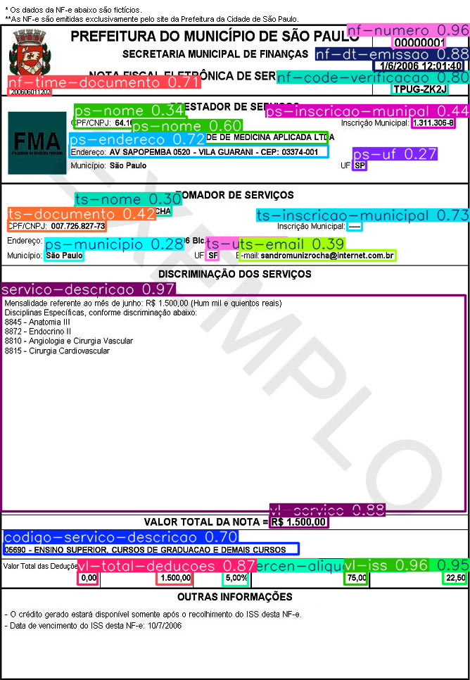

# NFS-e Yolov8

[Read in English](README.md)

## Overview
Este projeto fornece uma API para extração de dados de imagens e PDFs utilizando YOLO, FastAPI, e Tesseract.

## Requisitos
- Python >= 3.11

## Instalação

1. **Clone o repositório**:
    ```bash
    git clone https://github.com/JeandePaula/nfse-yolov8.git
    cd nfse-yolov8
    ```

2. **Crie um ambiente virtual (opcional, mas recomendado)**:
    ```bash
    python -m venv venv
    source venv/bin/activate  # Para Linux/MacOS
    venv\Scripts\activate  # Para Windows
    ```

3. **Instale os pacotes necessários**:
    ```bash
    pip install -r requirements.txt
    ```

   Ou instale manualmente:
    ```bash
    pip install fastapi>=0.112.1 uvicorn>=0.30.6 pytesseract>=0.3.13 ultralytics>=8.2.77 numpy>=1.26.4,<2.0.0 opencv-python>=4.10.0,<5.0.0 python-multipart>=0.0.9 pdf2image>=1.16.3
    ```

## Execução

1. **Inicie o servidor FastAPI**:
    ```bash
    uvicorn main:app --host 0.0.0.0 --port 8000
    ```

2. **Enviar uma requisição POST**:
    Você pode enviar uma requisição `POST` para o endpoint `/extract_data` utilizando `curl` ou um cliente HTTP como o Postman. Exemplo utilizando `curl`:

    - Para uma imagem:
        ```bash
        curl -X POST "http://0.0.0.0:8000/extract_data" -H "Content-Type: multipart/form-data" -F "file=@/caminho/para/sua/nf-imagem.jpg"
        ```

    - Para um PDF:
        ```bash
        curl -X POST "http://0.0.0.0:8000/extract_data" -H "Content-Type: multipart/form-data" -F "file=@/caminho/para/sua/nf-pdf.pdf"
        ```

## Saída Esperada

1. **Imagem Gerada**:
   Após o processamento, uma imagem chamada `output_image.png` será salva na raiz do projeto, conforme o exemplo a seguir:
   

2. **Exemplo de Saída JSON**:
    ```json
    {
        "servico-descricao": "“o e mil e quientos reais)",
        "vl-iss": "75,00",
        "nf-numero": "00000001",
        "vl-credito": "22,50",
        "vl-servico": "R$ 1.500,00",
        "nf-dt-emissao": "1/6/2006 12:01:40",
        "vl-total-deducoes": "0,00",
        "vl-percen-aliquota": "5,00%",
        "nf-code-verificacao": "TPUG-ZK2J",
        "ts-inscricao-municipal": "—",
        "ps-endereco": "Endereço: AV SAPOPEMBA 0520 - VILA GUARANI - CEP: 03374-001",
        "nf-time-documento": "20060601 1200",
        "codigo-servico-descricao": "05690 - ENSINO SUPERIOR, CURSOS DE GRADUACAO E DEMAIS CURSOS",
        "vl-base-calculo": "1.500,00",
        "ps-nome": "'PF/CNPJ: 64.167.648/0001-33",
        "ps-inscricao-munipal": "1.311.306-8",
        "ts-documento": "DPF/CNPJ: 007.725.827-73",
        "ts-email": "-rmail: sandromunizrochaQBinternet.com.br",
        "ts-uf": "SP",
        "ts-nome": "SANDRO MUNIZ ROCHA",
        "ps-municipio": "São Paulo",
        "ps-uf": "sP"
    }
    ```

## Nota Importante
**Atenção:** O modelo utilizado neste projeto não foi treinado de forma adequada devido à falta de imagens suficientes de Notas Fiscais de Serviço (NFS). Isso pode resultar em divergências ou imprecisões nos dados extraídos. Recomenda-se aprimorar o treinamento do modelo com um conjunto de dados mais amplo e diversificado para melhorar a precisão.

## Contribuição
Sinta-se à vontade para abrir issues e enviar pull requests para melhorar este projeto.

## Licença
Este projeto está licenciado sob os termos da licença MIT.
